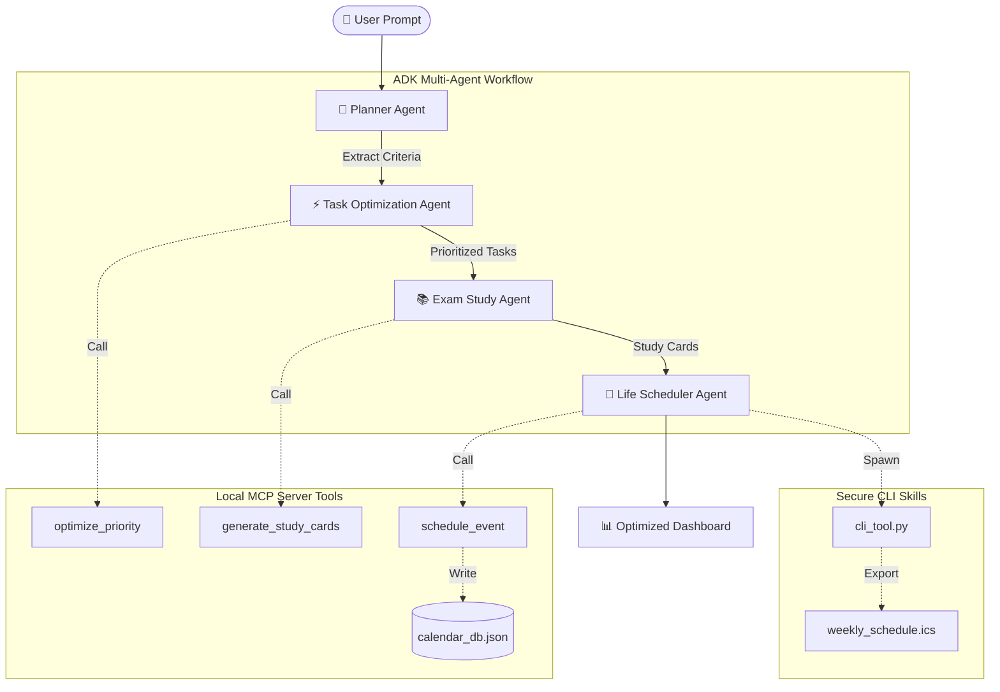

# 🤖 OmniPilot AI — Full-Stack Multi-Agent Workspace 📅⚡

> An offline-first **full-stack multi-agent planner and scheduling platform** built using **Google Agent Development Kit (ADK) principles** and **Model Context Protocol (MCP) architecture**.

---

# 🌐 Live Demo

🚀 **Runs Completely Offline**

> No API keys. No cloud dependency. No external AI services.

⚠️ The entire system executes locally on your machine.

---

# 🚀 Overview

**OmniPilot AI** is a developer-focused intelligent planning platform that orchestrates multiple AI agents to create optimized study, work, and life schedules.

The platform leverages **ADK workflow graph concepts**, **MCP server tools**, and secure local CLI skills to coordinate autonomous agents capable of reasoning, prioritizing, and scheduling tasks.


### 🧠 OmniPilot AI allows users to:

* 🤖 Coordinate multiple specialized AI agents
* 📅 Generate conflict-free schedules automatically
* 📚 Build active recall study plans
* ⚡ Prioritize tasks using the Eisenhower Matrix
* 🔄 Export schedules directly to calendar applications
* 🔒 Run everything fully offline with enhanced security

Built with a modern dashboard interface, OmniPilot delivers an AI-powered productivity experience without relying on external APIs.

---

# ✨ Key Features

## 🤖 ADK Multi-Agent Workflow

* 🧠 **Planner Agent** → Parses user requests and orchestrates workflow execution
* ⚡ **Task Optimization Agent** → Prioritizes tasks based on urgency and importance
* 📚 **Exam Study Agent** → Generates active recall cards and study sessions
* 📅 **Life Scheduler Agent** → Creates optimized schedules and resolves conflicts
* 🔄 Sequential graph execution pipeline

```text
START → Planner → Optimizer → Study → Scheduler → END
```

---

## 🔌 MCP Server Architecture

The platform exposes local tools using **Model Context Protocol (MCP)** patterns.

### Available MCP Tools:

* 🛠️ `optimize_priority`
* 📚 `generate_study_cards`
* 📅 `schedule_event`

Features:

* 📦 Structured JSON-RPC communication
* ⚡ Local tool invocation
* 🔒 Fully offline execution
* 🧩 Standardized tool schemas

---

## 📅 Intelligent Scheduling Engine

* 🕒 Automatic time-slot generation
* ⚠️ Conflict detection and resolution
* 📆 Weekly calendar planning
* 🧠 Study and productivity balancing
* 🎯 Goal-driven schedule optimization

---

## 📤 CLI Skills & Export System

The secure CLI tool (`omnipilot-cli`) allows:

* 📅 Export schedules as `.ics` calendar files
* 📝 Generate Markdown topic summaries
* ⚡ Trigger backend workflow skills safely

---

# 🔒 Security Architecture

Security is a first-class citizen in OmniPilot AI.

### 🛡️ Implemented Security Measures

* 🚫 **Path Traversal Protection**

  * Prevents unauthorized file access outside workspace
  * Blocks parent directory references (`../`)

* 🔐 **Subprocess Sanitization**

  * Sanitizes user inputs before shell execution

* 📏 **Input Boundary Validation**

  * Limits prompts to safe lengths
  * Removes unsafe HTML-like tags

* ⏱️ **Subprocess Isolation**

  * Executes CLI skills using secure subprocesses with strict timeout policies

* 🏠 **Workspace Restriction**

  * All generated files remain inside the local project workspace

---

# 🏗️ System Architecture



---

# 🛠️ Tech Stack

| Layer               | Technology                   |
| ------------------- | ---------------------------- |
| **Frontend**        | HTML5, CSS3, JavaScript      |
| **Backend**         | Python, FastAPI              |
| **AI Architecture** | ADK Workflow Principles      |
| **Communication**   | MCP (Model Context Protocol) |
| **Data Storage**    | JSON Database                |
| **CLI Skills**      | Python Subprocess            |
| **Deployment**      | Local Offline Environment    |

---

# 📂 Project Structure

```text
OmniPilot-AI/
│
├── agents.py                  # 🤖 Multi-Agent Workflow
├── server.py                  # 🚀 FastAPI Backend
├── mcp_server.py              # 🔌 MCP Tool Server
├── cli_tool.py                # ⚡ CLI Skills
├── calendar_db.json           # 📅 Local Calendar Storage
├── requirements.txt           # 📦 Dependencies
├── static/                    # 🌐 Frontend Assets
├── templates/                 # 🖥️ Dashboard UI
├── README.md
│
└── generated/
    ├── weekly_schedule.ics    # 📤 Calendar Export
    └── study_notes.md         # 📝 Generated Notes
```

---

# ⚙️ Installation

## 📌 Requirements

Before running this project, ensure you have:

✅ Python 3.13+

✅ pip

---

## 📥 Setup

Clone the repository:

```bash
git clone https://github.com/yourusername/OmniPilot-AI.git

cd OmniPilot-AI
```

Install dependencies:

```bash
pip install -r requirements.txt
```

---

# ▶️ Run Project

Start the application:

```bash
python -m uvicorn server:app --host 127.0.0.1 --port 3000
```

Open in browser:

```text
http://localhost:3000
```

---

# 🎬 End-to-End Demo Flow

### 1️⃣ Enter User Request

Example:

> "I have a chemistry exam next Friday. Schedule study sessions and gym slots."

### 2️⃣ Workflow Execution

* 🧠 Planner Agent parses request
* ⚡ Optimizer Agent prioritizes tasks
* 📚 Study Agent generates learning materials
* 📅 Scheduler Agent resolves conflicts
* 💾 Events stored locally

### 3️⃣ Review Results

* 💬 View multi-agent conversations
* 📊 Inspect JSON-RPC logs
* 📅 Analyze generated calendar timelines

### 4️⃣ Export Schedule

Click **Export ICS File** to generate:

```text
weekly_schedule.ics
```

Import directly into Google Calendar, Outlook, or Apple Calendar.

---

# 🔒 Offline First

✅ No OpenAI API

✅ No Gemini API

✅ No External Services

✅ No Internet Required

Everything runs entirely on your local machine.

---

# 🚀 Future Improvements

* 🌐 Cloud synchronization
* 🧠 Local LLM integration
* 🔔 Smart notifications
* 📱 Mobile companion app
* 🎙️ Voice-enabled planning assistant

---

# 👨‍💻 Author

**Abhishek Mehra**

Built with ❤️ for **AI Engineering & Multi-Agent Systems**

---

# 📜 License

This project is licensed under the **MIT License**.

---

# ⚡ Final Tagline

> **Plan Smarter. Learn Faster. Organize Everything.**


